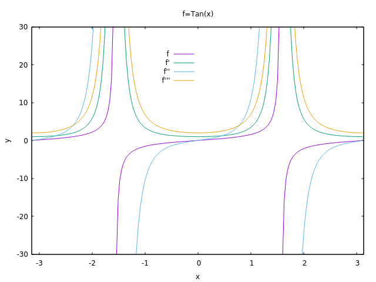
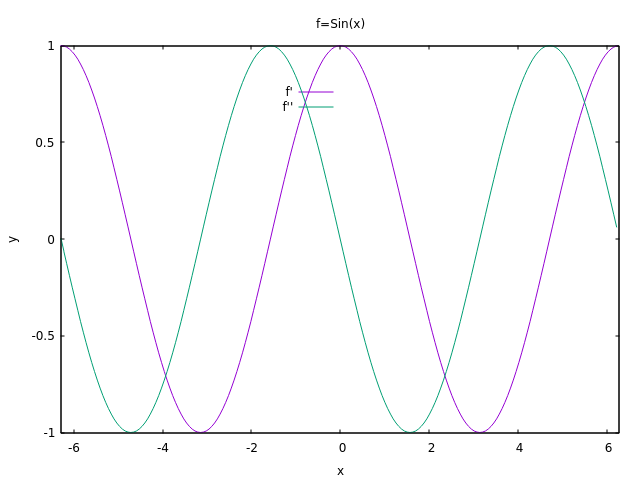

# Dynamic Automatic Differentiation in Rust

A pedagogical attempt at auto-differentiation. This is based on the autograd package and other variations of it as well as literature references (eg: The Art of Differentiating Computer Programs, An Introduction to Algorithmic Differentiation – Uwe Naumann).

Work in progress..

# Support:
- forward mode
- reverse mode
- a composition thereof for higher-order derivatives.

# Todo:
- Extend from scalar to multidimensional entities, with Ricci calculus for manipulating tensors and doing derivatives
- more ops and tests (see src/core.rs)

# Other:
- currently depends on Rust nightly

# Plots:

   
   

